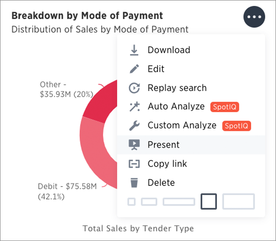

# Start a slideshow

Displaying your pinboard as a slideshow is a good way to present its contents to others.

Presenting your pinboard displays your visualizations in order from left to right and top to bottom.

To start a slideshow:

1.   Click on **Pinboards**, on the top navigation bar. 

      

2.   On the pinboard list page, click the pinboard you would like to present. 
3.   Click **Present** under the dropdown menu of the visualization you would like to start the slideshow with. 

      

4.   Use the left and right arrow keys to navigate between your pinboard's visualizations. 

      

    Click the **x** at the top right of the screen or push the Esc key to exit the slideshow view.

**Parent topic:** [Other pinboard actions](../../../pages/end_user_guide/pinboards/pinboard_actions.html)

