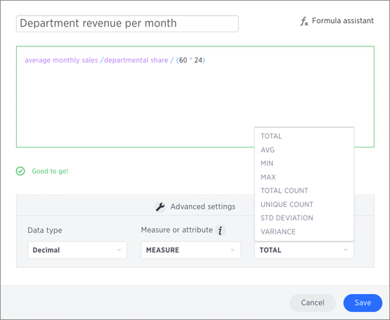

# 

1.  If you want to change what your formula returns, use the **Advanced settings**.Depending on your formula, you may be able to change:

    -   Data type
    -   ATTRIBUTE or MEASURE
    -   Aggregation type

    

